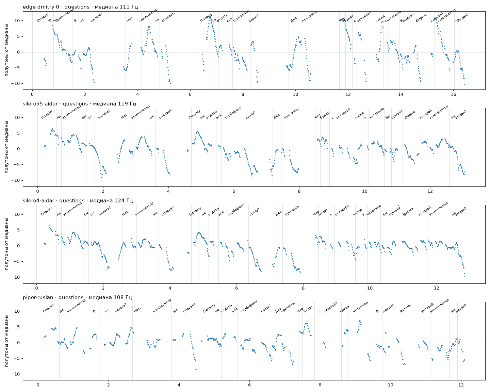

# Доклад голосом

> Озвучена версия доклада от 27.09.2026. 30.09 узлы 7–10 переписаны (три эпохи V8 вместо истории агента), озвучка не пересобиралась: главы слайдов 31–49 звучат по-старому. Пересборка — `build_audio.py extract` → правка `spoken.json` для изменённых слайдов → `build`.

**`annotations-voice.mp3`** — всё, что докладчик говорит по `../annotations.md`, подряд, мужским голосом: абзац «доклад в одном абзаце», 57 слайдов по порядку и готовые ответы на вопросы из Q&A-резерва. 1:07:09, 24 МБ, mp3 моно 48 кбит/с, громкость −16 LUFS.

- Перед каждым слайдом звучит его номер и название («Слайд двадцать два. Ставка не сыграла: ронг мэп»), на разделителях ещё и номер узла.
- Ремарку «пауза, пока зал читает слайд» голос не читает — вместо неё две секунды тишины. На передышках звучит только фраза для зала.
- Главы вшиты в файл (ID3 CHAP): плееры с поддержкой глав покажут их списком. Таблица с таймкодами — `chapters.md`, по ней удобно перемотать к слайду.

## Голос и интонация

Перед озвучкой девять вариантов мужского голоса прогнаны на отрывках доклада: объяснение (ярусы), вопросы (три вопроса узлов), числа и отрывок, густо набитый терминами. Каждый отрывок распознан обратно Whisper medium — это WER, доля слов, которые распознаватель услышал не так. Высота тона снята Praat: размах — от 5-го до 95-го перцентиля в полутонах, СКО — насколько голос двигается вокруг своей медианы. Чем больше обе величины, тем живее интонация; у плоского «роботного» чтения они малы.

| голос | WER, объяснение | WER, вопросы | слов/мин | медиана, Гц | размах, полутоны (объяснение / вопросы) | СКО, полутоны |
|---|---|---|---|---|---|---|
| **edge-tts `ru-RU-DmitryNeural`, темп +0 %** | **7.5 %** | 12.5 % | 121 | 109 | **11.9 / 16.8** | **3.67 / 4.69** |
| edge-tts `ru-RU-DmitryNeural`, темп −10 % | 7.5 % | 6.2 % | 110 | 108 | 11.9 / 17.3 | 3.69 / 4.79 |
| Silero v5.5 `aidar` | 11.9 % | 15.6 % | 137 | 120 | 10.0 / 11.2 | 2.91 / 3.29 |
| Silero v5.5 `eugene` | 11.9 % | 18.8 % | 163 | 96 | 7.9 / 10.2 | 2.38 / 2.84 |
| Silero v4 `aidar` | 9.0 % | 12.5 % | 138 | 124 | 9.4 / 10.8 | 2.87 / 3.32 |
| Silero v4 `eugene` | 11.9 % | 18.8 % | 168 | 100 | 6.5 / 8.8 | 1.87 / 2.53 |
| Piper `ru_RU-dmitri-medium` | 19.4 % | 18.8 % | 171 | 184 | 9.1 / 9.2 | 2.42 / 2.66 |
| Piper `ru_RU-ruslan-medium` | 17.9 % | 15.6 % | 150 | 111 | 11.6 / 9.9 | 3.44 / 2.76 |
| Piper `ru_RU-denis-medium` | 19.4 % | 28.1 % | 147 | 142 | 13.4 / 13.8 | 3.60 / 3.98 |

Выбран `ru-RU-DmitryNeural`: самый разборчивый на объяснении и единственный, у кого на вопросах размах тона заметно шире, чем на повествовании (16.8 полутона против 11.9) — то есть вопрос звучит вопросом. Silero (локальная модель: синтез в 12–20 раз быстрее реального времени на двух ядрах, ударения можно ставить вручную) по разборчивости рядом, но интонационно площе: размах 8–11 полутонов, СКО 1.9–3.3; кроме того, «бэ» у трёх из четырёх его вариантов Whisper слышит как «бы». Piper-голоса заметно хуже по обоим показателям (термины «Игнишн» и «Маглев» превращаются в «лидничный» и «магниев»). На отрывке с терминами все голоса одинаковы (WER 45–50 %): Whisper записывает «Турбофан», «нормалайз-юзер», «ронг мэп» латиницей — TurboFan, normalizeUser, wrongMap, — то есть слышит их правильно, а WER считает расхождением.

Разница WER на вопросах между +0 % и −10 % — одно слово: «со ставкой» Whisper на +0 % услышал как «с оставкой», на слух это одно и то же. Темп оставлен родным для голоса, +0 %: около 120 слов в минуту — близко к живому темпу доклада (53 минуты на ~6000 слов речи). Быстрее или медленнее — скоростью в плеере. На отрывке с числами WER не показателен (Whisper пишет числа цифрами); все числа в распознанном тексте edge-голоса верные: 505, 775, 70, 38, 13,5, 0,12, 0,79.

Как звучат вопросы — `intonation-questions.png`, контур тона с разметкой слов; сверху вниз edge Dmitry, Silero v5.5 aidar, Silero v4 aidar, Piper ruslan:



У edge Dmitry контуры те, что носитель ставит сам:
- «Спасёт ли компилятор бэ от налога?» — резкий подъём на «спасёт» до +10 полутонов и спад к концу: общий вопрос с «ли», центр на слове перед «ли» (ИК-3).
- «Почему не отдать всё Турбофану сразу?» и «Что будет со ставкой…?» — пик на вопросительном слове (+11) и спад (ИК-2).
- «Нет, компилятор не спасает.» и «Две причины.» — утвердительное падение до −10 полутонов в конце (ИК-1).

У Silero те же места выражены вдвое слабее: подъём на «спасёт» около +6, пик на «что» в длинном вопросе около +3. У Piper ruslan подъём на «спасёт» — около +4, вопрос звучит почти как утверждение.

## Как текст готовится к озвучке

Голос читает только русский текст: латиница, цифры и код читаются по буквам или неверно. Поэтому речь переводится в произносимую форму:

1. `build_audio.py extract` — вынимает из `../annotations.md` поле «Говорим» каждого слайда и абзац-выжимку → `speech.json` (исходный текст реплик, 7619 слов).
2. `spoken.json` — тот же текст в произносимой форме по правилам и словарю `NORMALIZE.md`: числа словами в нужном падеже («в две тысячи восьмом году», «ноль двенадцать миллисекунды», «в шесть и шесть десятых раза»), латиница — как её говорит разработчик на конференции («Турбофан», «Маглев», «вэ восемь», «ронг мэп», «налл», «лог-ай-си»), без разметки. Перевод делали агенты по этому словарю; каждая из 594 замен просмотрена.
3. `build_audio.py check` — механическая проверка: в `spoken.json` не осталось латиницы, цифр и символов, и **каждое русское слово исходника дошло до озвучки в том же порядке** (менять можно только числа, латиницу и, для согласования, окончания).
4. `build_audio.py build` — озвучка по кускам (заголовок слайда, абзацы), тишина между ними, склейка, выравнивание громкости (EBU R128, −16 LUFS — громкость подкастов), главы.

## Проверка результата

`qa_audio.py` распознаёт каждый озвученный кусок Whisper medium и сверяет с текстом: все ли числа исходника слышны (Whisper пишет их цифрами — так ловятся ошибки и нормализации, и произношения) и WER по кириллице. Итог — `qa-report.md`. Эта проверка нашла настоящий дефект: edge-tts оборвал поток на слайде 43 после 30 слов из 138 без всякой ошибки. Сборка теперь отбраковывает кусок, прочитанный быстрее 220 слов в минуту (голос читает около 130), и переозвучивает его. Остальные замечания в отчёте (15 слайдов) ещё не разобраны до конца; в просмотренных — это запись Whisper, а не ошибки голоса: версии «Нода двадцать четыре, двадцать один, ноль» он пишет «24, 21, 0», «до одного и двух сотых» — «1.2», а латинские термины пишет латиницей.

`intonation_audio.py` проверяет интонацию сплошь по готовому файлу — `intonation-report.md`. Все 63 куска речи живые: СКО тона 3.3–4.6 полутона (у самых плоских голосов из сравнения 1.9–2.8). Из 36 вопросов Whisper разметил 32; пик тона на акценте у них в медиане +8.7 полутона, ниже +4 — только одинокое «Почему?» посреди абзаца на слайде 11.

## Пересборка

```
pip install edge-tts            # и ffmpeg в системе
python3 build_audio.py extract  # после правок annotations.md
#   ... перенести правки в spoken.json по NORMALIZE.md ...
python3 build_audio.py check
python3 build_audio.py build    # озвучит только изменённые куски (кэш в .cache/)
pip install faster-whisper praat-parselmouth
python3 qa_audio.py && python3 intonation_audio.py   # проверки, по желанию
```

edge-tts ходит в онлайн-сервис озвучки Microsoft Edge, нужна сеть. Сервис изредка отвечает пустым потоком — скрипт повторяет запрос с паузой. За прокси с собственным корневым сертификатом путь к нему передаётся в `TTS_CA_BUNDLE`; проверка TLS при этом остаётся включённой. Темп — `TTS_RATE` (например, `-10%`).
